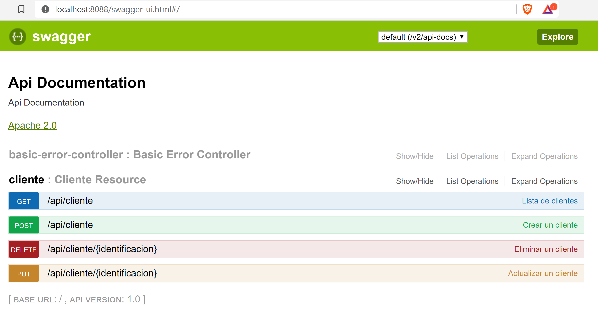

# Spring-boot-swagger-postgres

- WEB
- JPA
- HIBERNATE
- DEVTOOLS
- POSTGRES
- LOMBOK
- SWAGGER
- SECURITY

## Run application and created jar maven

```cmd
$ mvn clean install spring-boot:run
```

## Swagger-ui
http://localhost:8088/swagger-ui.html#/



## Create Docker Image
### pom.xml
```xml
<build>
	<finalName>e-reservation</finalName>
    <plugins>
        <plugin>
            <groupId>org.springframework.boot</groupId>
            <artifactId>spring-boot-maven-plugin</artifactId>
        </plugin>
        <plugin>
            <groupId>io.fabric8</groupId>
            <artifactId>docker-maven-plugin</artifactId>
            <version>0.21.0</version>
            <configuration>
                <images>
                    <image>
                        <name>carlmacd/${project.build.finalName}</name>
                        <build>
                            <from>openjdk:latest</from>
                            <entryPoint>java -Dspring.profiles.active=pdn -jar /Users/carlmacd/application/${project.build.finalName}.jar</entryPoint>
                            <assembly>
                                <basedir>/Users/carlmacd/application/</basedir>
                                <descriptorRef>artifact</descriptorRef>
                                <inline>
                                <id>assembly</id>
                                <files>
                                    <file>
                                        <source>target/${project.build.finalName}.jar</source>
                                    </file>
                                </files>
                                </inline>
                            </assembly>
                            <tags>
                                <tag>latest</tag>
                            </tags>
                            <ports>
                                <port>8088</port>
                            </ports>
                        </build>
                        <run>
                            <namingStrategy>alias</namingStrategy>
                        </run>
                        <alias>${project.build.finalName}</alias>
                    </image>
                </images>
            </configuration>
        </plugin>
    </plugins>
</build>
```
### properties-pdn.yaml
```JSON
server:
  port: 8088
spring:
  security:                                        
    user:
      name: carlos
      password: admin
  datasource:
    url: jdbc:postgresql://postgres_server:5432/postgres 
    username: postgres                             
    password: admin                                
    driver-class-name: org.postgresql.Driver       
  jpa:
    hibernate:
      ddl-auto: create-drop                        
    generate-ddl: true
    show-sql: true  
```

## Run application and created image maven

```shell
$ mvn clean install docker:build
```

## Command docker and upload image https://hub.docker 
```shell
$ docker images
$ docker login
$ docker push [name-image]
```

## Create container docker
```shell
$ docker run -d --name ereservation --add-host=postgres_server:192.168.22.33 -p 8088:8088 name-image:latest
$ docker ps -a
$ docker logs -f ereservation
$ docker stop ereservation 
$ docker restart ereservation
$ docker logs -f ereservation
```


## License

The MIT License (MIT). Please see [License](LICENSE) for more information.